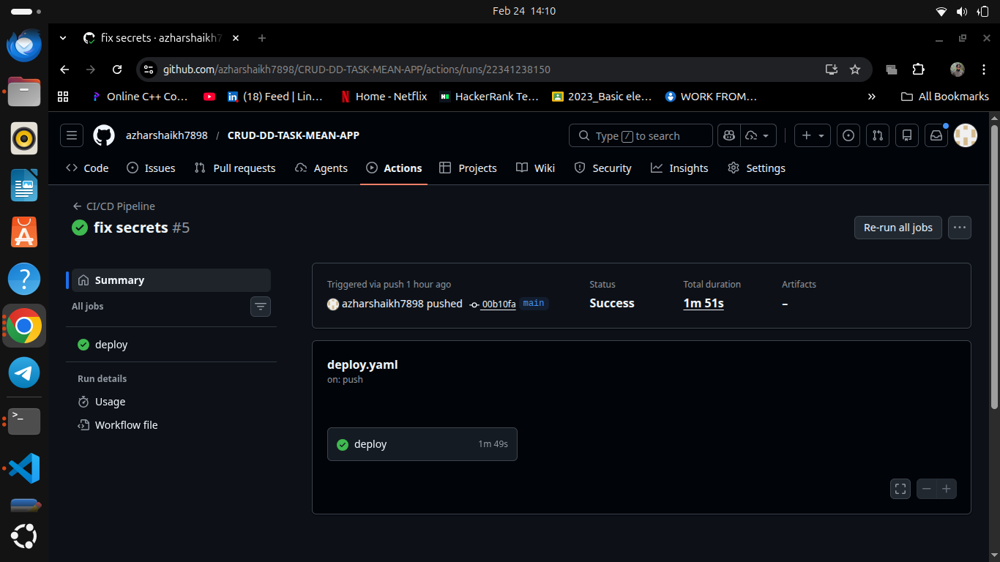
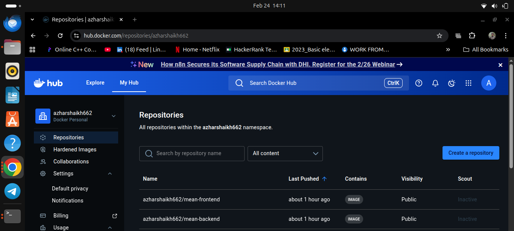
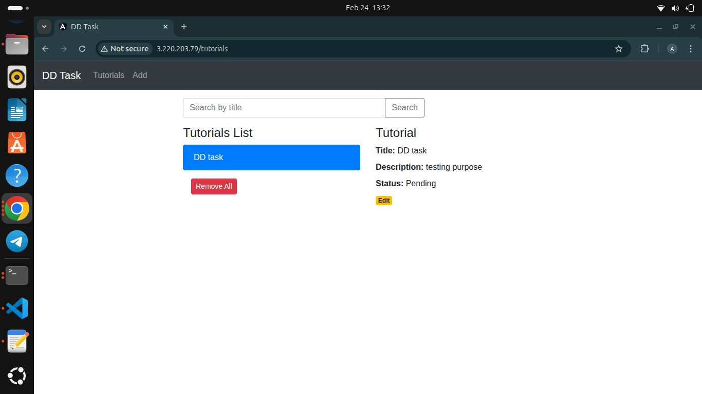
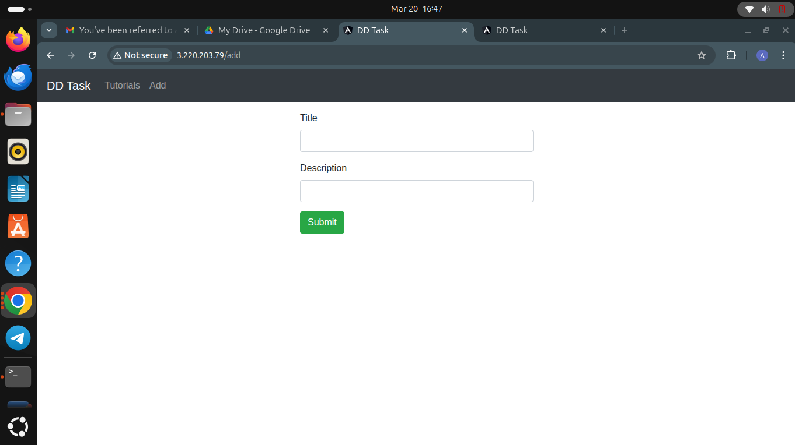

# MEAN Stack CRUD Application

This project is a full-stack CRUD application built with the **MEAN stack**:
- **MongoDB**
- **Express.js**
- **Angular 15**
- **Node.js**

The application manages a collection of tutorials, each with an ID, title, description, and published status. Users can create, retrieve, update, delete, and search tutorials by title.

---


## Project Setup & Usage


### Backend (Node.js/Express)
1. Navigate to the backend folder:
	```bash
	cd backend
	npm install
	```
2. Update MongoDB credentials in `app/config/db.config.js` if needed.
3. Start the server:
	```bash
	node server.js
	```


### Frontend (Angular)
1. Navigate to the frontend folder:
	```bash
	cd frontend
	npm install
	```
2. Start the Angular app:
	```bash
	ng serve --port 8081
	```
3. Open [http://localhost:8081/](http://localhost:8081/) in your browser.
4. To modify API interaction, edit `src/app/services/tutorial.service.ts`.


## Run with Docker Compose

From the project root, build and start all services:
```bash
docker compose up -d --build
```

Application URLs:
- Frontend: [http://localhost:4200](http://localhost:4200)
- Backend API: [http://localhost:8080/api/tutorials](http://localhost:8080/api/tutorials)

To stop all services:
```bash
docker compose down
```

---

## CI/CD & Deployment

This project includes a GitHub Actions workflow for CI/CD, which builds, pushes Docker images, and deploys to a remote server. See `.github/workflows/deploy.yaml` for details.

---


## Screenshots

Below are key screenshots demonstrating the application and infrastructure:

### 1. GitHub Actions CI/CD Pipeline
Shows the workflow runs and status for automated build, push, and deployment.



### 2. Docker Hub Repositories
Displays the Docker Hub account with pushed images for frontend and backend containers.



### 3. Tutorials List View
Main UI showing the tutorials list, search, and details panel for a selected tutorial.



### 4. Add Tutorial View
Form for adding a new tutorial, including title and description fields.




---

## Nginx Setup

The frontend is served using Nginx. Configuration can be found in `frontend/nginx.conf`.

---

## License

This project is for educational and demonstration purposes.
